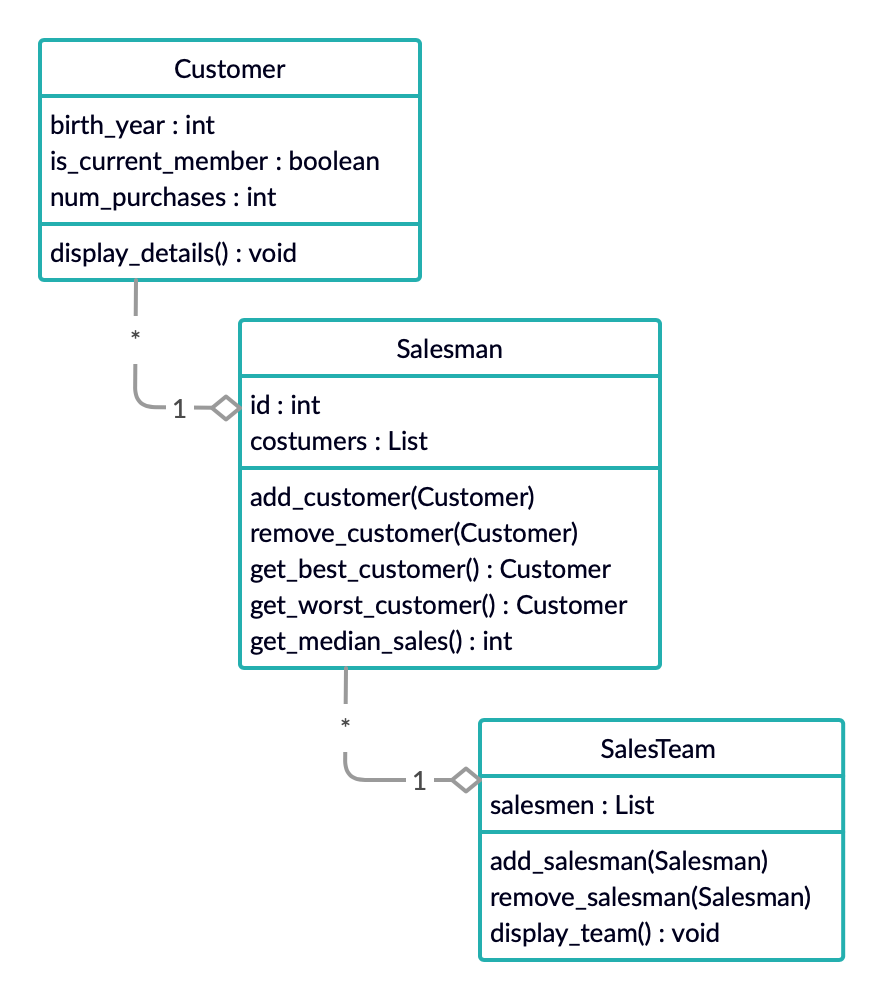

# Windcave Programming Test #

> Junior Test – Internship (2020)  
> 8th Nov

- [x] [Question 1](#question-1--regular-polygon)
- [x] [Question 2](#question-2--salesman-customers)
- [ ] [Question 3](#question-3--circular-buffer)

## Question 1 – Regular Polygon ##

#### Compile and Run ####

```bash
$ javac Question1.java -d build/
$ java -cp build/ Question1
```

#### Thoughts ####

The `area()` method could have been further reused but would come at cost of understandability, and thus was not simplified.

## Question 2 – Salesman Customers ##

#### Acknowledgements ####

- I'm not very familiar with C++, I judged from common design practices in other languages.
- In `improved.cpp` I mostly just fixed the issues present in `original.cpp`, sticking to existing style.
- I've also included `improved.py` to demonstrate my improved composite design

#### Design ####



#### Limitations on Scope ####

I did not put parent-child double link between Customer-Salesman and Salesman-SalesTeam. I assumed that a customer can have multiple salesmen and a salesman can belong to multiple teams.

Also these are aggregation relationships not composition because customers can exist without salesmen or sales teams.

#### Recommendations ####

- type checking and unit testing to make implementation more robust
- checking if a customer already has a salesman (if desired)
- checking if a salesman already belongs in a team (if desired)
- [Performance] `bestCustomer` `worstCustomer` and `medianSales` only needs to be calculated when changes to `customers` list

## Question 3 – Circular Buffer ##

#### Major Problems ####

- `m_WriteOffset` never wraps around the end of `m_Buffer` array, this will cause the CircularBuffer to overflow immediately
- likewise `m_ReadOffset` never wraps around either
- I think there needs to be checking for when read offset is ahead of write offset (empty) and vice versa (full)?

#### Uses for Ring Buffers ####

Ring buffers are used when buffering between two threads and when memories have a restricted size.  
In embedded systems when data are streaming in I guess.

#### Correct the Class ####

I don't think my threading knowledge in Java translates here, sorry.

## Authors

- Windcave – [website](www.windcave.com)
- Simon Shan – *hire me please* – [mightbesimon](https://github.com/mightbesimon)

based on questions by Windcave
